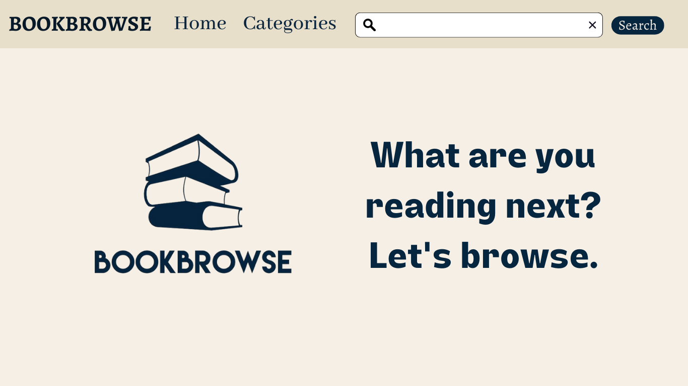
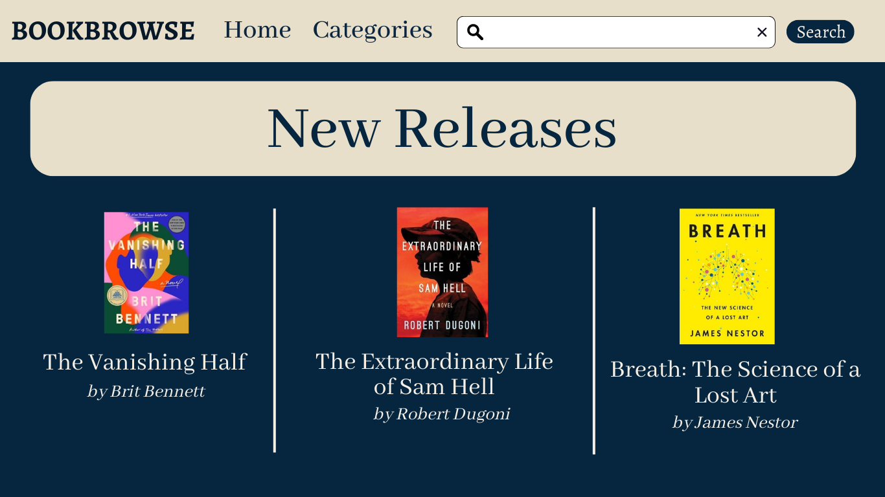
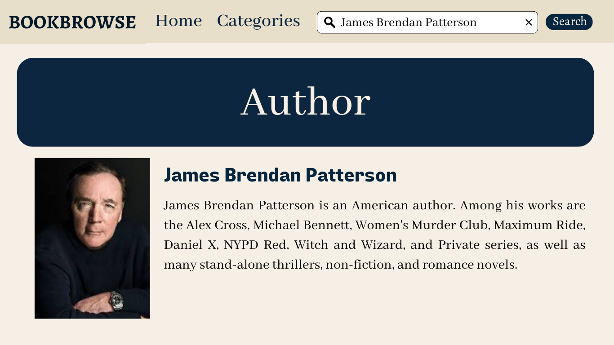

# BookBrowse

--- 

## Introduction 

BOOKBROWSE is a goto website for passionate readers. We have a wide-range of collection for readers who'd like to choose what their next book is going to be. We enable readers to choose from a list of genres, search by ISBN or author. 

Our services include:
- Choose the next book you're going to read
- Search from a range of genres or by authors you follow
- Simplify your search if you know the ISBN

## Data Feeds
[Goodreads API](https://www.goodreads.com/api)

[NY Times API](https://developer.nytimes.com/docs/books-product/1/overview)

[Amazon Best Selling Books Dataset](https://www.kaggle.com/datasets/sootersaalu/amazon-top-50-bestselling-books-2009-2019)

## Storyboard

IMG1: Home Page 

IMG2: New Releases

IMG3: Author Page

## Functional Requirements

#### Assumptions

English is the only language used for all searches.

#### Dependencies

1) Book Information is available
2) Author Information is available

### Requirement 1: Search for Books

#### Scenario 
-->Refer IMG1

As a user interested in books, I want to be able to search for based on any part of the name or the ISBN and get information about the book
 
#### Examples

1.1  
**Given** a feed of book data is available  

**When** I search for “Atomic Habits”  

**Then** I should receive:  

Book Title: Atomic Habits  

Author: James Clear

Genre: Self-help book

Summary: An atomic habit is a regular practice or routine that is not only small and easy to do but is also the source of incredible power; a component of the system of compound growth. more...  

1.2  
**Given** a feed of book data is available  

**When** I search for “9783442178582”  

**Then** I should receive:  

Book Title: Atomic Habits  

Author: James Clear

Genre: Self-help book

Summary: An atomic habit is a regular practice or routine that is not only small and easy to do but is also the source of incredible power; a component of the system of compound growth. more...  

### Requirement 2: Search for Author and get books

#### Scenario
-->Refer IMG2

As a user, I want to look up authors so that I can learn more about them and get a list of their published works so I can read more (perhaps because I liked one of their novels or books).

#### Example

**Given** a feed of author data is available

**When** I search for "J. K. Rowling"

**Then** I should receive:

Author: J. K. Rowling

Bio: J.K. Rowling is the famous British author of the worldwide attention gaining Harry Potter series. Her best-selling novels have sold more than 400 million copies and won numerous awards. The books have also been adapted to screen in a series of blockbuster films.  more...

List of books to choose:
1) Harry Potter Series
2) The Casual Vacancy
3) The Christmas Pig
4) Fantastic Beasts and Where to Find Them
Etc.

### Requirement 3 : Top 10 books of a genre

#### Scenario:

As a user, I want to be able to view top 10 list from a genre

#### Example

**Given** Genre categorization for books is available

**When** I search for "Thriller"

**Then** I should receive:

Top 10 books from Thriller:

1) Gone Girl
2) The Silent Patient
3) Verity
4) ...

10. The Girl on the Train

### Requirement 4 : New Releases published on Home page

#### Scenario:
-->Refer IMG3

As a User, I want to be able to view list of newly released books on the homepage.

### Requirement 5 : Post reviews and ratings

#### Scenario:

As a user, I want to post reviews and ratings for the book

#### Assumptions

A form is available to fill in the review for the book

#### Example

**Given** a feed of book data is available

**When** I search a book

**Then** I should be able to add reviews for books

## Team Members

- Vamsi Kalepu
- Mayura Rane
- Monica Varu
- Sandeep Susarla

## Weekly Meeting

Monday at 7 PM on Teams

